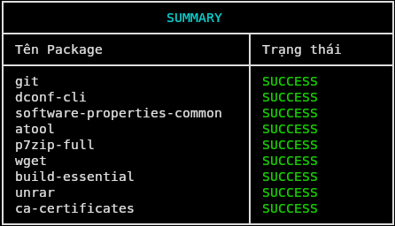

# ⚙️ Linux Setup Configuration (Ubuntu Only)

> Bộ script hỗ trợ **cài đặt nhanh môi trường làm việc** trên Ubuntu.  
> Phù hợp cho máy mới hoặc khi cần setup lại toàn bộ hệ thống.

---

## 📌 Lưu ý quan trọng

- ⚠️ **Chỉ hỗ trợ Ubuntu** (không áp dụng cho các distro khác)
- 🌐 Quá trình tải yêu cầu **kết nối mạng ổn định**
- 🔄 Nếu bị gián đoạn do mạng → **chạy lại script**, tiến trình sẽ tự động tiếp tục
- 🧰 Yêu cầu **cài đặt `curl` trước**

---

## 🧰 Cài đặt `curl` (bắt buộc)

```bash
sudo apt update
sudo apt install -y curl
```

---

## 🚀 Cài đặt nhanh (Khuyến nghị)

Script tổng hợp – cài đặt các gói & cấu hình cần thiết **setup.sh**:

```bash
curl -fsSL https://raw.githubusercontent.com/devmindtan/UtilityBox/refs/heads/main/Configurations/setup-configuration/Linux/apps/setup.sh | bash
```



---

## 📦 Cài đặt từng ứng dụng (Tùy chọn)

### 🐳 Docker

```bash
curl -fsSL https://raw.githubusercontent.com/devmindtan/UtilityBox/refs/heads/main/Configurations/setup-configuration/Linux/apps/docker.sh | bash
```

---

### 🌐 Google Chrome

```bash
curl -fsSL https://raw.githubusercontent.com/devmindtan/UtilityBox/refs/heads/main/Configurations/setup-configuration/Linux/apps/google.sh | bash
```

---

### 🧠 JetBrains Toolbox

```bash
curl -fsSL https://raw.githubusercontent.com/devmindtan/UtilityBox/refs/heads/main/Configurations/setup-configuration/Linux/apps/jetbrains.sh | bash
```

---

### 🇻🇳 Unikey (Bộ gõ tiếng Việt)

```bash
curl -fsSL https://raw.githubusercontent.com/devmindtan/UtilityBox/refs/heads/main/Configurations/setup-configuration/Linux/apps/unikey.sh | bash
```

---

### 💬 Telegram

```bash
curl -fsSL https://raw.githubusercontent.com/devmindtan/UtilityBox/refs/heads/main/Configurations/setup-configuration/Linux/apps/telegram.sh | bash
```

---

## ✅ Gợi ý sử dụng

- 👉 Máy mới → dùng **setup.sh**
- 👉 Chỉ cần cài riêng từng app → dùng các script **Optionals**
- 👉 Có thể chạy lại script nhiều lần, **không gây lỗi**

---
